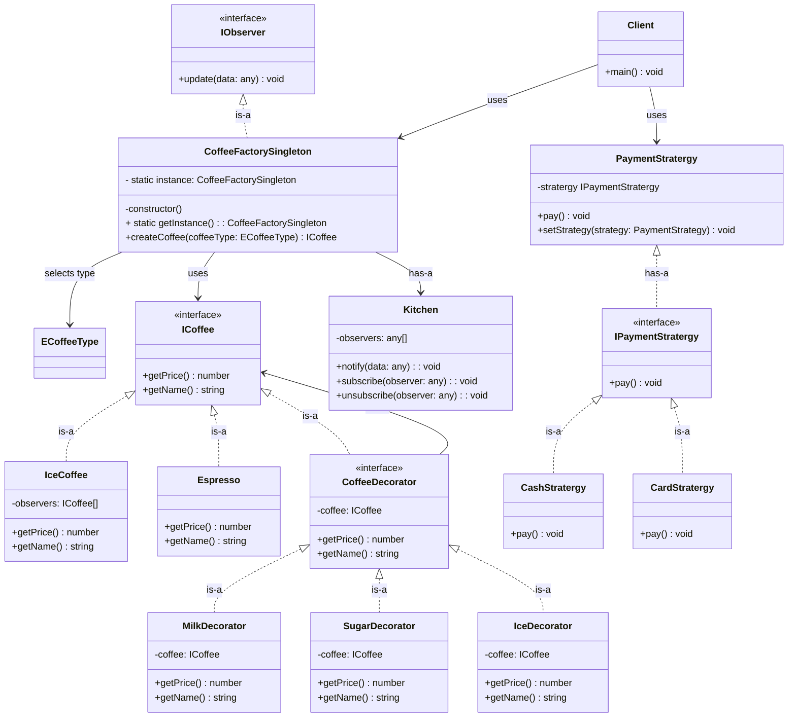

# Coffee Ordering System

---

## Description

Build a tiny console app for a coffee shop.

## Requirements

- Base drinks: Espresso, Tea
- Add-ons: Milk, Sugar, Whipped Cream
- Different payment methods: Cash, Card
- Notify kitchen when order is placed

## Decisions

- For addons can use `Decorator Pattern`. With this we can add different behaviours.
- For create diffrent types of Coffees `Factory Pattern`. With that we can generate different types of coffees without split into / create multiple objects.
- Need to maintain Kitchen / Coffee factory object for tracking purpose (for `Notify kitchen when order is placed` requirement). For that `Singleton Pattern`. It defines we can have only one factory / shop.
- For payments `Strategy Pattern`. This allows to chnage the algo when the runtime dynamically.
- For notify kitchen `Observer Pattern` can be used

## Class Diagram

