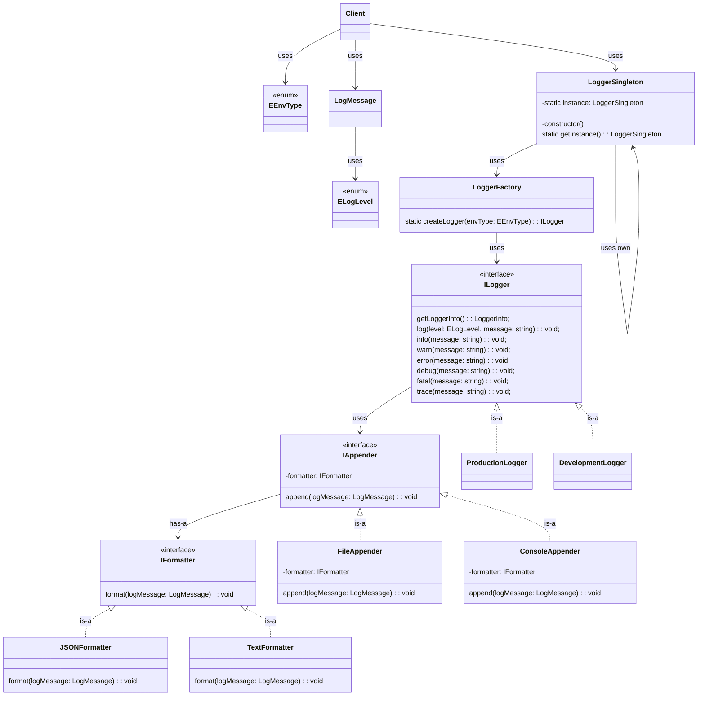

# Logger System

---

## Description

Build a large sacle logger application

## Requirements

- Needs to verify that only one logger instance not multiples
- Supports multiple formats [`text`, `json`, `yaml`]
- Logger should have methods for log messages as user preferences
- Supports multiple LOG LEVELS [`error`, `warn`, `info`]
- Supports multiple outputs / appenders [`console`, `file`]
- Log message should include `LEVEL`, `TIME`, `MESSAGE`
- Logger should support both developement and production scenarios

- All the things should be extensible
- Logger should work correctly under the multi thread environments

- These are the current output types can be

```bash
TRACE -> console only (development)
DEBUG -> console + debug.log
INFO  -> console + app.log
WARN  -> console + app.log
ERROR -> console + error.log + Sentry/Datadog
FATAL -> console + error.log + Alerts/Crash Reporting
```

## Decisions

- Needs to verify that only one logger instance. For that `Singleton Pattern`
- For dynamic output formats `Strategy Pattern`
- For dyanmic appenders / output types `Strategy Pattern`
<!-- - For handle requests according to each level can use `Chain Of Responsibility Pattern` -->

## Class Diagram


