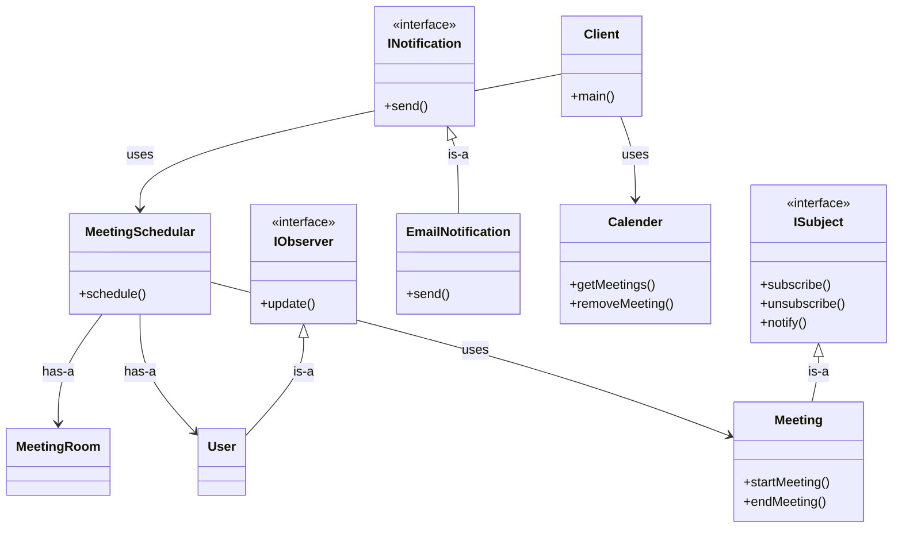

# Meeting Schedular

## Requirements

- There are `n` number of meeting rooms
- Book a meeting in any meeting room at given interval (start and end time, capacity)
- Send notifications for all the users who are invited to the meeting
- Use meeting room for track the meetings (date and time)

## Class Diagram

